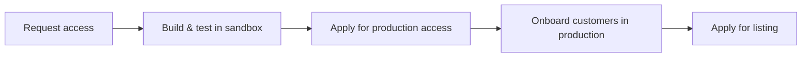

## Why Build on Ramp?
By building an app for Ramp, you can:

- Enhance your product with real-time financial data
- Expand your reach to a growing customer base
- Strengthen customer retention through deeper integration

## App Listing Timeline

### 1. Request Access
Start by requesting access to build an app [here↗](https://ramp.com/developer-api). You’ll provide basic information about your company and use case. Once approved, you’ll receive:

A sandbox account for testing and development
Access to the Developer Console, where you can configure OAuth2 and submit required documentation

### 2. Build & test in sandbox
Use our [Getting Started](/guides/getting-started) guide to connect to the Ramp API and begin developing your integration.

<b>Deliverables:</b>
- Working app in sandbox
- Proper use of scopes and endpoints
- OAuth2 flow implemented

### 3. Apply for production access
Production access allows your app to connect to real Ramp customers via OAuth2.

<b>What to submit in Developer Console:</b>
- A description of your integration
- A demo (OAuth2 flow, data flows, UI/UX)
- Requested API scopes
- Security certifications (SOC 2 Type 2, ISO 27001, etc.)
- Data access policies and storage practices
- Ramp will review your submission and contact you with approval or follow-up questions.

<b>Security best practices to follow:</b>
- Encrypt sensitive data in transit and at rest
- Use MFA and least-privilege access
- Maintain patching, monitoring, and secure backups
- Provide clear data handling and retention documentation

### 4. Onboard customers in production
Once approved, begin using OAuth2 to onboard real customers to your app. Important: Ensure your customers understand that only users with Admin or Business Owner roles can authorize your application.

<b>Usage requirements to qualify for listing</b>

- At least 3 active customers using each requested scope
- Error rate below 10% per scope

### 5. Apply for listing
When you meet the usage threshold, submit your listing request via the Developer Console along with the required assets and demo credentials. Once approved, your app will be featured in our in-product App Center and on our website at ramp.com/integrations↗

<b>Usage requirements</b>
- 3+ production customers per API scope
- Error rate below 10% per scope
- Marketing assets

<b>Public app description</b>
- Logo (1024x1024px, 1:1)
- Landing page image (16:10, min 800px)
- Support & testing

<b>Links to your Website, Privacy Policy, and Terms of Service</b>
- A hosted setup guide with clear usage instructions
- A support alias with clear escalation paths and response expectations
- A functioning demo environment with test credentials Ramp can use to QA data flows

### Additional Requirements
- Description of your migration process
- A demo video of successful sync behavior
- Mapping of how Ramp objects correspond to objects in the external accounting system (EG. Transactions, Reimbursements, Bills, etc)
Ramp reserves the right to revoke a listed App at any time if requirements are no longer met. This includes lack of support materials, broken demo environments, or degradation of production functionality. Continued listing depends on maintaining a high-quality experience for Ramp customers.

## Example App Listing
